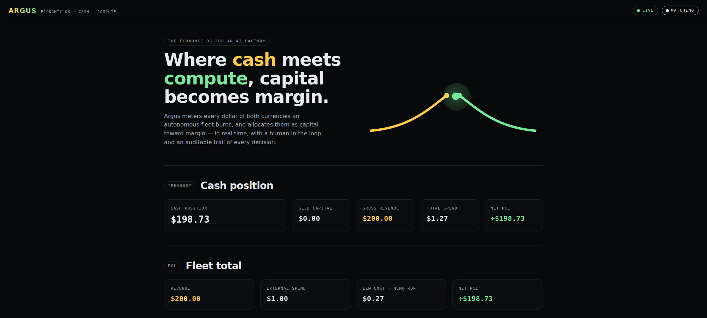
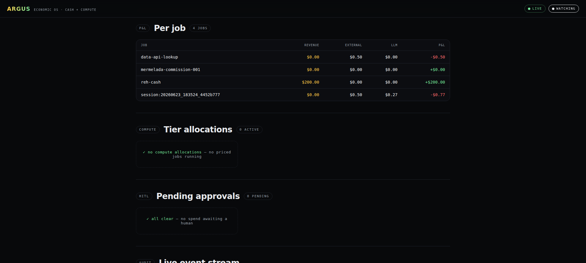

<p align="center">
  
</p>

<h1 align="center">Argus</h1>

<p align="center"><strong>Where cash meets compute, capital becomes margin.</strong><br>
<em>Agents spend. Argus watches. You approve.</em></p>

Argus is a financial control plane for autonomous agents. A Hermes plugin
that sits **between the agent and its wallet** and gates every dollar
before it moves — across two fungible capitals at once: **cash** (Stripe)
and **compute** (NVIDIA Nemotron).



## The mark

One eye, holding open. It's the avatar the bot wears in the human-in-the-
loop chat — the *holding* state, when a spend is paused waiting on you.
One of the hundred eyes of Argus Panoptes, in code.

| Token | Value | Use |
|---|---|---|
| `--bg` | `#070A0E` | canvas, dashboard, pupil |
| `--amber` | `#F5A524` | cash, the gate, the iris |
| `--amber-hi` | `#FFBA47` | iris highlight, hover, live tick |
| `--amber-lo` | `#C77F12` | iris rim, striations, audit lines |
| `--green` | `#76E89A` | compute, margin positive, approve |
| `--red` | `#E26A6A` | reject, negative margin, danger |

---

## The problem

> *Your AI agents can spend real money. Who approves it?*

Agents already move real dollars — API calls, inference, SaaS, Stripe.
The dashboards report **after** the money is gone — and sometimes they
lie. A well-intentioned agent can burn thousands in a single night:
`$7,420 unapproved · uncaught @ 02:14 AM` is not a hypothetical.

## The idea

> *Argus gates every dollar before it moves.*

A control plane that sits **between the agent and its wallet** — policy,
human approval, and real-time P&L on every spend. Five steps, every time:

| 01 Declare spend | 02 Evaluate policy | 03 Approve or escalate | 04 Enforce payment | 05 Record P&L |
|---|---|---|---|---|
| Agent states intent to move money before any call fires. | Argus scores the spend against cash & compute tiers. | Auto-approve the trivial, route the serious to a human. | Sits **in-path** and intercepts the real Stripe payment. | Revenue and measured cost booked in real time. |

This is **in-path enforcement — not passive observability**.

---

## Engine 01 — Cash tiering

> *One config. Three gates.*

Every spend is sorted by size. Thresholds live in `cash_policy.yaml` —
**config-driven, no hardcode**.

```yaml
cash_tiers:
  - max: 1.00
    approve: auto       # Tier 1 — < $1 — the trivial just clears
  - max: 10.00
    approve: manager    # Tier 2 — < $10 — a human holds it
  - max: inf
    approve: finance    # Tier 3 — > $10 — the highest bar
```

- **Tier 1 — auto-approve.** Under a dollar, Argus clears the spend with
  no human in the loop. Every cent still metered and booked to P&L.
- **Tier 2 — manager approval.** Approve and the spend clears. Reject
  and the card is never charged.
- **Tier 3 — finance approval.** The highest bar. Used for one-shot
  high-value spends and SaaS provisioning.

## Engine 02 — Compute tiering

> *Argus decides which model a job deserves — by margin.*

Compute is money. [`hermes-telemetry`](https://github.com/nujovich/hermes-telemetry)
— a custom Hermes plugin built for this — already prices Nemotron sessions in
dollars; Argus reads that ledger directly and routes each job to the
model its margin earns:

| Scenario | Revenue | Burn | Margin | Routes to |
|---|---|---|---|---|
| **Premium** | $200 | $15 | **+$185** | **ULTRA** — Nemotron 3 Ultra 550B |
| **Low margin** | $50 | $2 | **+$48** | **BASE** — Nemotron 9B |
| **Negative** | $0 | $2 | **−$2** | **REJECT** — no model runs |

> Cash meets compute. **Margin chooses the model.**

Each job is routed to the model its margin earns — Ultra, Base, or
rejected — and the per-job P&L updates live on the dashboard.

---

## Built on the rails that matter

| # | Rail | What it does |
|---|---|---|
| 01 | **Hermes plugin** | Agent integration via `pre_tool_call` / `post_tool_call` hooks. |
| 02 | **NVIDIA Nemotron via NIM** | Compute capital — priced per session by `hermes-telemetry`. |
| 03 | **Stripe** | Cash capital — revenue intake via signature-verified webhooks. |
| 04 | **In-process enforcement** | The hook fails **closed** — validated against real Stripe Skills. |
| 05 | **[hermes-telemetry](https://github.com/nujovich/hermes-telemetry) (OSS)** | Read-only dependency for in-path cost metering and P&L. |
| 06 | **Fully config-driven** | YAML cost-centers + tiers — no hardcode. |

## Architecture — six layers, Ledger at the center

```
        Capture ─→ Ledger ←─ Policy ←─ Enforcement
                     ↑           ↑              ↕
                     │           │
                     │     Compute Allocator
                     │           ↕
                Dashboard ───────┘
       (Capture also reads llm_cost from hermes-telemetry, read-only)
```

| Layer | Role |
|---|---|
| **Capture** | `pre_tool_call` / `post_tool_call` hooks + Stripe webhooks. Writes revenue, external spend, declarations. |
| **Ledger** | SQLite WAL DB. Unified cash + compute ledger, cost centers, budgets, audit, tokens. |
| **Policy** | **Pure function**: `(declaration, snapshot) → Verdict ∈ {ALLOW, NEEDS_APPROVAL, TIER_ASSIGNED, REJECT}`. No I/O, no clock. |
| **Enforcement** | The hook (Layer 1, in-process) + the Stripe Issuing authorization webhook (Layer 2, card network). Fails **closed**. |
| **Compute Allocator** | Assigns the Nemotron tier per job, re-evaluates each turn, emits downgrade orders. |
| **Dashboard** | React tab inside Hermes. Per-job P&L, fleet total, tier allocations, pending approvals, live event stream. |

**Dependency rule.** Ledger is the center. Policy is pure. Enforcement
is the only writer of cash decisions; Compute Allocator is the only
writer of compute-tier decisions. Both write through the same audit
trail. Full design in [`CLAUDE.md`](./CLAUDE.md).

---

## Status

**Engine complete.** The five logic layers (Ledger, Policy, Enforcement,
Capture, Compute Allocator) plus signature-verified revenue intake are
implemented and tested — full suite green (162 passing). The React
Dashboard UI surfaces in the demo are live; broader fleet view is the
remaining piece.

## Run the tests

```bash
pip install -r requirements-dev.txt
python3 -m pytest
```

## The standalone dashboard

`standalone.py` boots the SPA and the API on a single origin (`:9119`),
no Hermes required. The same surfaces the plugin renders inside
Hermes — Treasury, Fleet total, Per-job P&L, Tier allocations, Pending
approvals, Live event stream — served as one page.



```bash
pip install fastapi pydantic anyio pyyaml uvicorn
python3 standalone.py        # → http://127.0.0.1:9119
```

The full long-form capture (hero, treasury, fleet total, per-job,
allocations, approvals, audit stream — all in one shot) lives at
[`docs/dashboard-full.png`](docs/dashboard-full.png).

## Demo without an agent

The dashboard hits the same code path the hook does, via
`POST /api/plugins/argus/sim/spend`. Useful for development:

```bash
curl -X POST http://127.0.0.1:9119/api/plugins/argus/sim/spend \
  -H 'content-type: application/json' \
  -d '{"job_id":"demo","cost_center_id":"default","projected_usd":5.0}'
```

A pending approval will appear in the dashboard — click Approve or
Reject. The full reproducible recipe is in [`DEMO.md`](./DEMO.md).

## Install (dev)

```bash
# 1. Build the frontend bundle
npm install
npm run build

# 2. Symlink into Hermes
ln -s "$PWD" ~/.hermes/plugins/argus

# 3. Tell the running dashboard to rescan
curl http://127.0.0.1:9119/api/dashboard/plugins/rescan
```

Open the dashboard; the **Argus** tab appears at the end.

## Layout

```
argus/
├── CLAUDE.md           # design doc — single source of truth
├── DEMO.md             # reproducible demo recipe
├── SUBMISSION.md       # hackathon writeup
├── FUTURE.md           # post-deadline roadmap
├── plugin.yaml         # Hermes plugin manifest (Python side)
├── __init__.py         # register(ctx) → wires hooks + revenue intake
├── capture.py          # Capture layer (pre/post tool, webhooks)
├── enforcement.py      # Enforcement (synchronous hold, fails closed)
├── policy.py           # pure decide() function
├── db.py               # ledger + approvals + audit (SQLite WAL)
├── matchers.py         # Stripe spend-command patterns
├── config.py           # paths and cost-center loading
├── schema.sql          # ledger schema (ledger, approvals, audit, tokens, …)
├── cost_centers.yaml.example
├── skills/             # argus-request-spend, argus-request-compute
├── examples/           # mermelada-studio reference agent
├── dashboard/
│   ├── manifest.json
│   ├── plugin_api.py   # FastAPI router → /api/plugins/argus/
│   └── dist/index.js   # BUILT IIFE — do not hand-edit
├── src/                # React source for the tab
├── build.mjs           # esbuild → dashboard/dist/index.js
├── site/               # standalone Astro landing page
└── tests/
```

## Roadmap

- **Runtime compute enforcement** — hard-stop a job mid-flight when burn
  blows the projection (cooperative downgrade ships today).
- **Multi-tenant control plane** — one Argus governing a fleet across
  orgs, with per-tenant cost centers and budgets.

Full post-deadline plan in [`FUTURE.md`](./FUTURE.md).

## Further reading

- [`CLAUDE.md`](./CLAUDE.md) — design doc and single source of truth.
- [`DEMO.md`](./DEMO.md) — reproducible demo recipe.
- [`SUBMISSION.md`](./SUBMISSION.md) — hackathon writeup, beat by beat.
- [`FUTURE.md`](./FUTURE.md) — what's explicitly out of scope for v1.
- [`hermes-telemetry`](https://github.com/nujovich/hermes-telemetry) — the read-only compute-metering plugin Argus builds on.

---

> **Agents spend. Argus watches. You approve.**
>
> github.com/nujovich/argus · x.com/NUjovich
