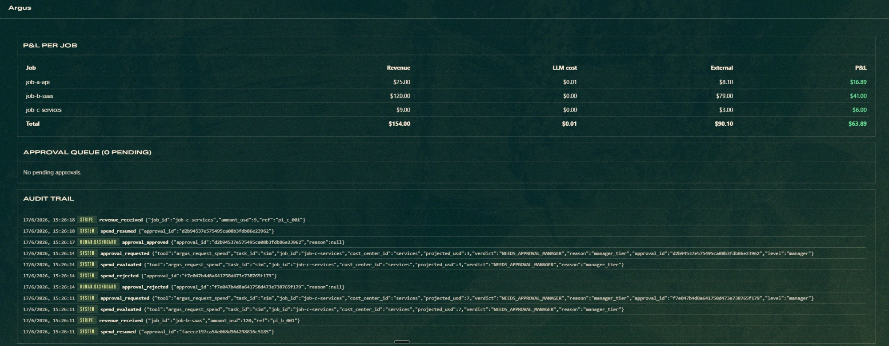

# Argus — hackathon submission writeup

> Drop-in copy for the hackathon submission form. Each section maps to a
> common form field. Pick what fits; remix the rest. The 30/60/300-word
> versions of the elevator pitch are at the top so you can paste the
> right one per field.

---

## Tagline (≤ 100 chars)

**Stripe gives agents a wallet; Argus puts a hundred eyes on it.**

---

## Elevator — 30 words

Argus is a horizontal financial control plane for autonomous agents.
It meters every dollar Hermes agents spend via Stripe Skills, tracks
P&L per job, and gates each spend through a human-in-the-loop approval
queue.

## Elevator — 60 words

Stripe Skills give Hermes agents a wallet, but no enterprise CFO will
hand that wallet to an autonomous agent without controls. Argus is the
control plane that fixes that: it sits in the `pre_tool_call` hook,
meters every dollar in and out per job, tracks live P&L (joining LLM
cost from `hermes-telemetry` read-only), and gates spends through a
tier-aware human approval queue rendered inside the Hermes dashboard.

## Elevator — ~300 words (problem → solution → why now)

Hermes 0.16 ships **Stripe Skills**: agents can now buy things,
provision SaaS, pay per-call APIs. This is huge. It is also the
moment finance teams say *"absolutely not."* Stripe's per-action
limit is a static $/call ceiling — fine for prototypes, useless for
the enterprise question of *"how much have we spent on this initiative
this quarter, and who approved it?"*

**Argus** answers that question. It's a Hermes plugin that sits in the
`pre_tool_call` hook every time a Stripe skill is about to execute. It:

- **Meters** every revenue dollar in (Stripe webhooks) and every spend
  dollar out (Stripe Skills) into a unified per-job ledger.
- **Tracks** live P&L per job, joining LLM token cost from
  `hermes-telemetry` via a **read-only `ATTACH`** — zero code changes
  to telemetry.
- **Gates** every spend through a **pure-function policy**:
  `(job, projected_spend, ledger_snapshot) → ALLOW | NEEDS_APPROVAL`,
  with tier routing (auto / manager / finance) per cost center.
- **Holds** the agent synchronously in the hook until a human Approves
  or Rejects in the Hermes dashboard, then resumes execution from the
  exact pre-spend point — no native park/resume primitive needed.

Argus is **industry-agnostic**. The demo proves horizontality by
governing three unrelated jobs (pay-per-call API, SaaS provisioning,
one-off NVIDIA NIM purchase) with the **same** ledger, policy, and
approval queue. The agents run on **Nemotron 3 Ultra via NemoClaw**;
their cost shows up in Argus's P&L specifically Nemotron-priced,
surfaced by the ATTACH to `hermes-telemetry`.

Stripe gives agents a wallet. Argus puts a hundred eyes on it.

---

## What it does (form field: "Description")

Argus is a horizontal financial control plane for Hermes agents that
spend real money. It plugs into Hermes via `pre_tool_call` and:

1. **Meters** money flow — revenue in (Stripe webhooks) and external
   spend out (Stripe Skills), captured into a unified SQLite WAL
   ledger keyed by `job_id` and `session_id`.
2. **Tracks live P&L per job** — joining the already-priced LLM token
   cost from the `hermes-telemetry` plugin via read-only `ATTACH`. Zero
   modifications to telemetry; Argus is a pure consumer.
3. **Gates every spend** through a pure-function policy gate.
   Auto-approves under a per-cost-center threshold; routes
   manager-tier spends to managers; routes hard-cap breaches and large
   spends to finance.
4. **Synchronously holds** the agent inside the pre-execution hook
   until a human decides via the Approval Queue card in the Hermes
   dashboard. Approve → agent resumes. Reject → agent gets a clean
   block message and self-corrects.
5. **Audits everything** — every evaluation, request, decision, and
   resume gets a row in `audit_trail`. The dashboard surfaces this
   chronologically as the "what happened and who said yes" record
   enterprises need to put their wallet behind an agent.

---

## Architecture (form field: "How it's built")

Five layers, with the **Ledger** as the center and **Policy** as a
pure function. Only **Enforcement** writes runtime state — that's what
makes the brain unit-testable and the whole system simulable.

```
Capture ─→ Ledger ←─ Policy ←─ Enforcement
                ↑                      ↕
            Dashboard ────────────────┘
   (Capture also reads llm_cost from hermes-telemetry, read-only)
```

- **Capture** — Argus's own `pre_tool_call` hook records money in/out.
- **Ledger** — Argus's own SQLite WAL DB.
- **Policy** — pure `decide(decl, snapshot) → ALLOW | NEEDS_APPROVAL(level)`.
- **Enforcement** — same hook, blocks synchronously until a human
  decides in the dashboard, then returns `None` (allow) or the
  documented `{"action": "block", "message": ...}` (reject).
- **Dashboard** — React tab inside Hermes (no React bundle, theme CSS
  variables, FastAPI under `/api/plugins/argus/`).

The riskiest unknown going in — *can a plugin actually block a Stripe
spend before it settles?* — was resolved by reading the Hermes hook
source and using `pre_tool_call`'s block return value with a
synchronous-poll wait inside the hook itself. No Hermes core changes.

---

## NVIDIA pillar

Argus's code is model-agnostic, so NVIDIA only counts if the **demo
wiring** uses it. We deliver all three:

1. **Demo agents on Nemotron 3 Ultra via NemoClaw** — configured in
   Hermes (one-line `hermes model`), so the LLM cost surfaced in
   Argus's P&L is Nemotron-priced.
2. **NVIDIA-surface spend in the ledger** — Job C of the demo buys
   *NIM inference credits*. The `ref` field in the ledger row points
   directly at the NVIDIA spend. The Argus gating path treats it
   identically to any other Stripe charge.
3. **Audit-trail evidence** — every NVIDIA spend has a row in
   `audit_trail` and a P&L line in the dashboard. Judges can query it.

---

## Stripe pillar

- TEST mode end-to-end (CLAUDE.md §10).
- Revenue ingestion: `POST /api/plugins/argus/webhooks/stripe` accepts
  `payment_intent.succeeded` and `charge.refunded`. The demo drives
  this via simulated payloads; production swap is a Stripe CLI
  `stripe trigger ...` away.
- Spend gating: `argus_request_spend(job_id, projected_usd,
  cost_center_id, ref)` is the explicit declaration the agent calls
  before any Stripe charge; `stripe_*` tool calls are also intercepted
  as a backstop.
- Refund schema (negative `external_spend`) is in place; the call to
  `stripe.Refund.create()` is documented as Phase 5 since the gated
  path means spends are blocked **before** settlement, not after.

---

## Demo

A deterministic three-job driver (`scripts/demo.py`) runs against the
live Argus API. It walks the operator through:

1. **Job A — pay-per-call API** — five auto-approved micro-charges
   plus one manager-tier $8 batch.
2. **Job B — SaaS provisioning** — a single $79 charge that hits
   **finance** approval. This is the climactic beat: an approval card
   appears in the dashboard, the operator clicks Approve, the agent
   visibly resumes.
3. **Job C — one-off services** — buys $7 of NVIDIA NIM credits,
   gets rejected, then retries at $3 and is approved. Shows both
   branches.

Final P&L on the recorded take:



| Job              | Revenue | LLM (Nemotron) | External | P&L |
|---|---:|---:|---:|---:|
| job-a-api        | $25.00 | $0.01 | $8.10 | **+$16.89** |
| job-b-saas       | $120.00 | $0.00 | $79.00 | **+$41.00** |
| job-c-services   | $9.00 | $0.00 | $3.00 | **+$6.00** |
| **Total**        | **$154.00** | **$0.01** | **$90.10** | **+$63.89** |

The `$0.01` in the LLM column for `job-a-api` is **Nemotron 3 Ultra 550B
pricing**, surfaced live from `hermes-telemetry` via Argus's read-only
`ATTACH`. The audit trail card under the P&L records the full chain:
`spend_evaluated → approval_requested → approval_approved → spend_resumed`
for the approves, and the analogous `_rejected` chain for Job C's
first attempt.

Recipe in `DEMO.md`. Reproduces deterministically on any machine with
Hermes 0.16, a Nemotron / NemoClaw key, and ~10 minutes.

---

## Why it matters / what's next

The hackathon brief asked for "business tooling on top of Stripe
Skills + NVIDIA agents." Argus is the **horizontal** version of that
ask: not one automated company, but the **control plane every company
needs** before they let an agent touch the wallet. Phase 5 (post-
deadline):

- Real-time Stripe API for refund-on-reject.
- Cost-center YAML editor inside the dashboard.
- SSE in place of 1.5s polling.
- A `request_spend` agent skill so the explicit-declaration path is a
  one-line agent-side import, not a hand-rolled tool definition.
- Multi-tenant: per-org budgets and approval routing.

The brain (`policy.py`) is a pure function. Everything else is a
sufficient set of pipes around that fact.

---

## Links

- **Code:** https://github.com/nujovich/argus (branch
  `feat/scaffolding` — to be merged to `main` after the deadline)
- **Design doc:** [`CLAUDE.md`](./CLAUDE.md)
- **Demo recipe:** [`DEMO.md`](./DEMO.md)
- **Demo driver:** [`scripts/demo.py`](./scripts/demo.py)

---

## Team

[fill in]

---

## Credits

- **Hermes Agent** by Nous Research.
- **`hermes-telemetry`** by @nujovich (read-only dependency).
- **Stripe Skills for Hermes**.
- **NemoClaw / Nemotron 3 Ultra** for inference.
