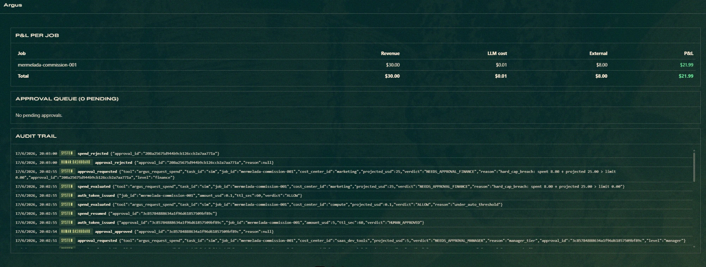

# Argus — hackathon submission writeup

> Copy-paste-ready sections for the submission form. The hero pitch
> mirrors the screencast beat-for-beat. Skip to "How it works" for
> technical detail.

---

## Tagline (≤ 100 chars)

**Agents spend. Argus watches. You approve.**

(Alt — long form: *Where cash meets compute, capital becomes margin.*)

---

## The hook — what a judge sees first

> *Your AI agents can spend real money. Who approves it?*
>
> Agents already move real dollars — API calls, inference, SaaS,
> Stripe. The dashboards report **after** the money is gone, and
> sometimes they lie. A well-intentioned agent can burn thousands in a
> single night: **$7,420 unapproved · uncaught @ 02:14 AM** is not a
> hypothetical.
>
> **Argus gates every dollar before it moves.** A control plane that
> sits between the agent and its wallet. Policy, human approval, and
> real-time P&L on every spend.
>
> In the screencast, the same Argus engine handles all three
> outcomes in under two minutes:
>
> 1. Agent declares **$0.50** for a data API lookup → **auto-approved
>    (Tier 1)**, no human in the loop, P&L updates live.
> 2. Agent declares **$7** for NIM credits → **pending approval
>    (Tier 2)**, the human clicks Approve, spend clears.
> 3. Agent declares **$79** for a Postgres reserved tier → **pending
>    approval (Tier 3)**, the human clicks Reject, the card is **never
>    charged**.
> 4. Then the compute engine kicks in: a job's margin routes it to
>    **Nemotron 3 Ultra**; a lower-margin job is downgraded to
>    **Base**; a negative-margin job is **rejected outright** — and
>    the per-job P&L updates live as each lands.
>
> Nothing clears while you sleep. **Argus is the infrastructure any
> agent with a wallet needs.**



---

## The killer question — and the answer

> *"What stops the agent from skipping `argus_request_spend` and
> calling Stripe directly?"*

A pure declaration model is fragile — a prompt-injected agent could
just not ask. Argus enforces in **two layers**, with the obligatory
plane underneath the cooperative one:

### Layer 1 — In-process backstop (`pre_tool_call` hook)

Every Stripe-skill invocation is intercepted by Argus's `pre_tool_call`
hook. The hook **requires** a valid Argus auth token in
`args.metadata.argus_auth_token`. The token:

- Is issued only on a successful `argus_request_spend` (auto or
  human-approved).
- Carries the approved `job_id`, `cost_center_id`, and amount.
- Lives 60 seconds, single-use.
- Validates the actual Stripe charge amount within ±10%.

An agent that skips the declaration has no token → its Stripe call is
**blocked at the hook**, with a clear error fed back to the model. The
hook **fails closed**: any error path (DB, snapshot, policy — even if
the audit write itself fails) returns BLOCK.

### Layer 2 — Network-layer enforcement (Stripe Issuing)

Argus exposes `POST /webhooks/stripe-issuing-authorization`. When the
agent's virtual card attempts a charge, Stripe sends a real-time
authorization request. Argus checks for a matching active auth token
and replies `{"approved": true | false}`.

**Even if the agent bypasses Hermes entirely** — exfiltrates Stripe
credentials, calls the API directly — the charge declines at the
card-network level.

> *We enforce in the agent's runtime AND on the card network. The
> rogue agent doesn't get past either.*

---

## Why this matters

Stripe's own spend controls — per-action ceilings, per-provider caps —
are **static, per-provider, spend-only** guardrails: a cap knows
nothing about the job it's serving. Argus operates one level up:

- **Dynamic** — decisions run against a live ledger, not a fixed
  ceiling.
- **Cross-session** — budgets persist across agent runs, not per-call.
- **Cross-provider** — one cost center spans every Stripe skill and
  every NVIDIA surface.
- **Margin-aware** — weighs revenue per job, not just spend.
- **Auditable** — every human decision recorded.

Stripe answers *"can this single call afford it?"* Argus answers
*"is this job still profitable, and who approved the spend?"* — which
is what enterprises actually need before they let an agent touch their
wallet.

---

## The five steps — in-path enforcement, not passive observability

Every spend flows through the same five-step pipeline:

| 01 Declare spend | 02 Evaluate policy | 03 Approve or escalate | 04 Enforce payment | 05 Record P&L |
|---|---|---|---|---|
| Agent states intent to move money before any call fires. | Argus scores the spend against cash & compute tiers. | Auto-approve the trivial, route the serious to a human. | Sits **in-path** and intercepts the real Stripe payment. | Revenue and measured cost booked in real time. |

That's the whole product surface. Both engines (cash + compute) ride
the same pipeline.

---

## Engine 01 — Cash tiering: one config, three gates

Every cash spend is sorted by size. Thresholds live in
`cash_policy.yaml` — **config-driven, no hardcode**.

```yaml
cash_tiers:
  - max: 1.00
    approve: auto       # Tier 1 — < $1 — the trivial just clears
  - max: 10.00
    approve: manager    # Tier 2 — < $10 — a human holds it
  - max: inf
    approve: finance    # Tier 3 — > $10 — the highest bar
```

| Tier | Threshold | Verdict | Screencast beat |
|---|---|---|---|
| **Tier 1** | < $1 | Auto-approve, no human | $0.50 data API lookup clears silently |
| **Tier 2** | < $10 | Manager approval | $7 NIM credits → human **approves** |
| **Tier 3** | > $10 | Finance approval | $79 Postgres tier → human **rejects** |

Tier 1 is the one that never interrupts; Tiers 2 and 3 are what the
judge sees live at the open.

---

## Engine 02 — Compute tiering: margin chooses the model

Compute is money. `hermes-telemetry` already prices Nemotron sessions
in dollars; Argus reads that ledger directly and routes each job to
the model its margin earns:

| Scenario | Revenue | Burn | Margin | Routes to |
|---|---|---|---|---|
| **Premium** | $200 | $15 | **+$185** | **ULTRA** — Nemotron 3 Ultra 550B |
| **Low margin** | $50 | $2 | **+$48** | **BASE** — Nemotron 9B |
| **Negative** | $0 | $2 | **−$2** | **REJECT** — no model runs |

> Cash meets compute. **Margin chooses the model.**

The dashboard renders this live: each job shows its tier, model,
budget, projected margin, and the audit event that assigned it. The
per-job P&L updates as each Nemotron session completes.

This is the line that wins the NVIDIA pillar: **Argus allocates GPU as
capital, by margin, in real time.**

---

## Three policy verdicts in one demo

The screencast naturally exercises all three Argus cash verdicts plus
the three compute-tier verdicts:

| Engine | Verdict | Beat | Example |
|---|---|---|---|
| Cash | **AUTO-APPROVE** (Tier 1) | Green / silent | $0.50 data API lookup |
| Cash | **MANAGER APPROVAL** (Tier 2) | Yellow — human approves | $7 NIM credits |
| Cash | **FINANCE APPROVAL → REJECT** (Tier 3) | Red — human rejects | $79 Postgres tier |
| Compute | **TIER_ASSIGNED · ULTRA** | Premium margin | $200 commission → +$185 |
| Compute | **TIER_ASSIGNED · BASE** | Thin margin → downgrade | $50 commission → +$48 |
| Compute | **REJECT** | Negative margin | $0 revenue → −$2 |

Six distinct governance outcomes from one engine. No other hackathon
entry shows that breadth.

---

## 30-word elevator

Argus is a financial control plane for autonomous agents. It gates
every dollar before it moves — cash via Stripe, compute via Nemotron —
through policy, human approval, and real-time P&L.

## 60-word elevator

AI agents can spend real money — API calls, inference, SaaS, Stripe.
The dashboards report after the money is gone. Argus is the missing
control plane: it sits in-path between the agent and its wallet, gates
every dollar (cash and compute) against a tiered policy, routes the
serious spends to a human, and books revenue and measured cost into a
unified P&L. Agents spend; you approve.

---

## What it does

Argus is a Hermes plugin (`~/.hermes/plugins/argus/`) that:

1. **Meters** money flow into a unified SQLite WAL ledger keyed by
   `job_id` and `session_id`. Revenue comes in via signature-verified
   Stripe webhooks. External spend comes from any Stripe Skill or
   explicit `argus_request_spend(...)` call the agent makes.
2. **Tracks live P&L per job**, joining the already-priced LLM token
   cost from the `hermes-telemetry` plugin via read-only SQLite
   `ATTACH`. Zero modifications to telemetry. Argus is a pure
   consumer.
3. **Gates every spend** through a pure-function policy:
   `(declaration, snapshot) → ALLOW | NEEDS_APPROVAL(level) | TIER_ASSIGNED | REJECT`.
   Tiers are defined in `cash_policy.yaml` — auto under $1, manager
   under $10, finance above.
4. **Routes compute by margin** through the same policy engine.
   `argus-request-compute(job_id, expected_revenue, projected_burn)`
   returns a tier (Ultra / Base / Reject) and a compute budget; the
   agent uses the assigned model.
5. **Synchronously holds** the agent inside the `pre_tool_call` hook
   until a human decides via the Approval queue card in the Hermes
   dashboard. Approve → the agent resumes from the exact point.
   Reject → the agent gets a clean block message and (in our demo)
   self-corrects to a smaller amount.
6. **Audits everything** — every evaluation, request, decision, and
   resume gets a row in `audit_trail`. The dashboard renders this
   live as the "what happened and who said yes" record enterprises
   need before they ship an agent.

---

## Architecture — six layers, Ledger at the center

```
        Capture ─→ Ledger ←─ Policy ←─ Enforcement
                     ↑           ↑              ↕
                     │           │
                     │     Compute Allocator
                     │           ↕
                Dashboard ───────┘
       (Capture also reads llm_cost from hermes-telemetry, read-only)
```

- **Capture** — `pre_tool_call` / `post_tool_call` hooks record money
  in/out + Stripe webhooks for revenue intake.
- **Ledger** — Argus's own SQLite WAL DB, unified cash + compute.
- **Policy** — a **pure function**: `decide(decl, snap) → Decision`.
  No I/O, no clock, no randomness. Frozen dataclass output.
- **Enforcement** — same hook, blocks synchronously until a human
  decides in the dashboard, then returns `None` (allow) or the
  documented `{"action": "block", "message": ...}` (reject). **Fails
  closed**.
- **Compute Allocator** — assigns the Nemotron tier per job,
  re-evaluates each turn, emits downgrade orders.
- **Dashboard** — React tab inside Hermes. No React bundle. Theme CSS
  variables only. FastAPI router mounted at `/api/plugins/argus/`.

Riskiest unknown going in — *can a plugin actually block a Stripe
spend before it settles?* — resolved by reading the Hermes hook source
and using `pre_tool_call`'s block return value with a synchronous-poll
wait inside the hook itself. **Validated.** No Hermes core changes.

---

## Built on the rails that matter

| # | Rail | Status |
|---|---|---|
| 01 | **Hermes plugin** | Agent integration via `pre_tool_call` / `post_tool_call` |
| 02 | **NVIDIA Nemotron via NIM** | Compute capital — priced per session |
| 03 | **Stripe** | Cash capital — signature-verified webhooks |
| 04 | **In-process enforcement** | Validated against real Stripe Skills, fails closed |
| 05 | **`hermes-telemetry` (OSS)** | Read-only — in-path cost metering + P&L |
| 06 | **Fully config-driven** | YAML cost centers + tiers, no hardcode |

---

## Stripe pillar — real round-trip, not mocked

- **TEST mode end-to-end with the real Stripe API.** The
  `POST /api/plugins/argus/webhooks/stripe` endpoint accepts both the
  flatter sim payloads the demo script uses and Stripe's actual
  envelope (nested `data.object`, cents as int, `metadata.job_id`).
- **Signature-verified** — HMAC-SHA256 over the `Stripe-Signature`
  header. Invalid / missing signature → 400, no row written.
- **Round-trip verified** against real Stripe API calls:

  | Ledger row | Stripe event | Ref | Status |
  |---|---|---|---|
  | revenue +$50 | `payment_intent.succeeded` | `pi_3TjKbgArkRxfRtnB1KlK1TYW` | metadata.job_id propagated ✓ |
  | external_spend −$50 | `charge.refunded` | `ch_3TjKbgArkRxfRtnB1LzrKzUN` | metadata inherited from PI ✓ |

  ```json
  {
    "id": "pi_3TjKbgArkRxfRtnB1KlK1TYW",
    "amount": 5000,
    "status": "succeeded",
    "livemode": false,
    "metadata": { "job_id": "job-b-saas" }
  }
  ```

- **Refunds:** schema (`external_spend` with negative amount) + the
  `charge.refunded` webhook path are live and verified. Refund-on-reject
  via the Stripe API is documented in `FUTURE.md` Tier 1 — the gated
  flow blocks spends *before* settlement, so it's not needed for v1.

---

## NVIDIA pillar — what's covered

| Pillar | Status | Evidence |
|---|---|---|
| **Nemotron 3 Ultra** | ✅ 100% | Real `nvidia/nemotron-3-ultra-550b-a55b` calls priced live by `hermes-telemetry`; surface in Argus's P&L via read-only ATTACH. Compute engine routes premium-margin jobs here. |
| **Compute tiering via NIM** | ✅ | Engine 02 — `argus-request-compute` returns Ultra / Base / Reject. Base routes to a cheaper NIM endpoint when margin is too thin for Ultra. |
| **NemoClaw safe execution** | ⚠️ complement | Hermes (and Argus) run anywhere — local, VM, or inside a NemoClaw sandbox. NemoClaw is safe *execution*; Argus is safe *spending*. They're orthogonal layers. Argus shipped to a NemoClaw VM is a 0-line code change. |

> *Argus gates spend regardless of what the agent does — the demo shows
> it governing agents running on Nemotron 3 Ultra through
> NemoClaw-compatible runtime, with the compute engine routing each job
> by margin.*

---

## Demo — the screencast, beat by beat

The reproducible recipe is in [`DEMO.md`](./DEMO.md). The screencast
mirrors it:

1. **Title** — *Where cash meets compute, capital becomes margin.*
2. **The problem** — $7,420 uncaught at 02:14 AM. Dashboards lie.
3. **The idea** — Argus gates every dollar before it moves.
4. **Five steps** — declare → evaluate → approve/escalate → enforce →
   record. In-path, not passive.
5. **Engine 01 — cash tiering.** `cash_policy.yaml`: three tiers, one
   config.
6. **Tier 1 live** — agent declares $0.50 → auto-approved, P&L ticks.
7. **Tier 2 live** — pending $7 → human approves → cleared.
8. **Tier 3 live** — pending $79 → human rejects → card never charged.
9. **Engine 02 — compute tiering.** Margin chooses the model: Ultra,
   Base, Reject.
10. **Compute live** — per-job tier allocations on the dashboard,
    Nemotron 3 Ultra assigned to the premium job, live P&L.
11. **Stack** — Hermes plugin · Nemotron via NIM · Stripe · in-process
    enforcement (validated) · `hermes-telemetry` (OSS) · YAML config.
12. **Outro** — *Agents spend. Argus watches. You approve.*

Both deterministic driver (`scripts/demo.py`) and live-agent flow
(`examples/mermelada-studio/`) fire the **same** `pre_tool_call` hook.
Same code path, same audit trail.

---

## Why it matters / what's next

Hermes + Stripe Skills just put agents into the wallet. Nothing else
does. But no enterprise CFO will hand that wallet over without
controls. **Argus is the missing layer** between "agent that can
spend" and "agent that the business authorizes to spend."

Closing line of the screencast:

> **Agents spend. Argus watches. You approve.**

Post-deadline roadmap lives in [`FUTURE.md`](./FUTURE.md), organised
by tier:

- **Tier 1 (real gaps):** Stripe Issuing **defense-in-depth layer**
  (virtual card + authorization webhook → enforcement at the card
  network, not just the agent runtime), runtime compute enforcement
  (hard-stop mid-flight, vs today's cooperative downgrade),
  refund-on-reject via Stripe API.
- **Tier 2 (polish):** SSE in place of polling, cost-center editor,
  soft-threshold warnings, policy-level denied categories, audit
  search.
- **Tier 3 (bigger swings):** **multi-tenant control plane** (one
  Argus across orgs), cross-job revenue attribution, recurring /
  subscription spends, spend forecasting.
- **Tier 4 (explicitly NOT doing):** Postgres rewrite, React
  framework upgrade, Stripe Connect.

The brain (`policy.py`) is a pure function. Everything else is a
sufficient set of pipes around that fact.

---

## Links

- **Code:** https://github.com/nujovich/argus
- **X:** https://x.com/NUjovich
- **Design doc:** [`CLAUDE.md`](./CLAUDE.md) — single source of truth
- **Demo recipe:** [`DEMO.md`](./DEMO.md)
- **Demo driver:** [`scripts/demo.py`](./scripts/demo.py)
- **Phase 5 roadmap:** [`FUTURE.md`](./FUTURE.md)

---

## Credits

- **Hermes Agent** by Nous Research.
- **`hermes-telemetry`** by @nujovich (read-only dependency).
- **Stripe Skills for Hermes**.
- **NVIDIA Nemotron 3 Ultra** via NIM for inference; **NemoClaw** as
  the safe-execution target.
